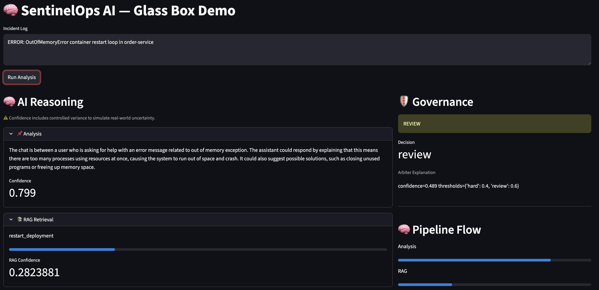
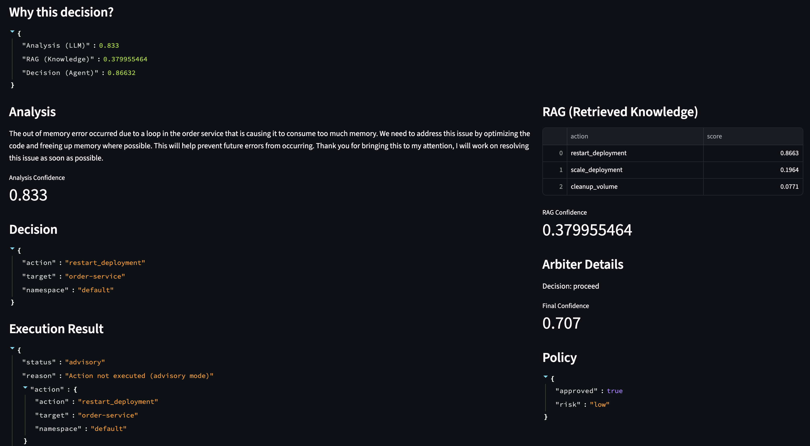
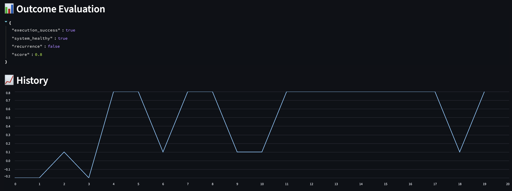
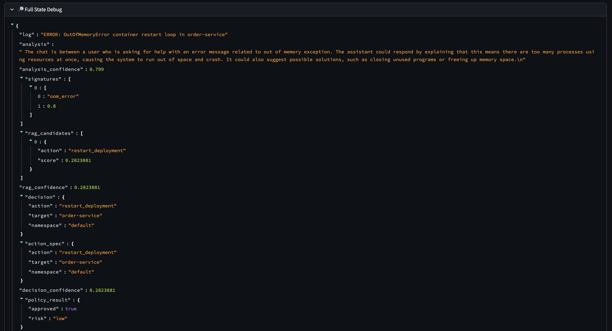

# SentinelOps AI

## Overview

SentinelOps AI is a **Glass-Box AI Ops demo platform** designed to demonstrate how to build **governed, explainable, multi-agent AI systems** for incident response in cloud-native environments.

This is **not a production system** — it is an **architecture-first demo** focused on:

* Explainability over autonomy
* Governance over blind execution
* System design over feature completeness

---

## Architecture First Approach

📄 **Full architecture and design rationale:**  
See [`docs/ARCHITECTURE.md`](./docs/ARCHITECTURE.md)

📄 **Key design decisions and tradeoffs:**  
See [`docs/ADR.md`](./docs/ADR.md)

This document explains:

* Why each layer exists
* Tradeoffs (LangGraph, Qdrant, YAML policy)
* Separation between probabilistic vs deterministic logic
* Governance and risk mitigation strategy

---

## Purpose of this Demo

This project demonstrates:

* How to design **AI systems beyond simple LLM calls**
* How to implement **governance layers for AI safety**
* How to separate:

  * **Reasoning (LLMs)**
  * **Control (Policy / Arbiter)**
  * **Execution (Systems)**
* How to build **trustable AI systems** instead of black-box automation

---

## Core Concepts Demonstrated

* Multi-Agent Orchestration (LangGraph)
* Retrieval-Augmented Generation (Qdrant)
* Model Abstraction (LLM Router)
* Policy-as-Code (YAML-driven governance)
* Human-in-the-Loop readiness
* Glass-Box Explainability UI

---

## System Flow

```text
Log → Analysis → Signature → RAG → Decision → Arbiter → Policy → Execution → Evaluation
```

---

## Key Architectural Principle

> The LLM is treated as an **unreliable component** — and is governed accordingly.

* LLM generates hypotheses
* RAG adds context
* Decision proposes action
* Arbiter evaluates confidence
* Policy validates safety
* Execution is isolated

---

## Glass-Box UI (Core Differentiator)

### AI Reasoning + RAG + Decision



The UI exposes:

* Full reasoning trace
* RAG retrieval candidates
* Decision structure
* Confidence breakdown

---

### Governance + Pipeline Flow + Execution



* Arbiter decision (halt / review / proceed)
* Confidence flow across pipeline
* Execution isolation (advisory mode)

---

### Outcome Evaluation + History





* Outcome scoring
* System health simulation
* Incident history tracking

---

## Repository Structure

```
agents/        → reasoning units (analysis, rag, decision)
orchestrator/  → LangGraph pipeline
core/          → arbiter, metrics, config
rag/           → embeddings + retrieval
llm/           → model abstraction layer
execution/     → safe action routing
config/        → YAML-driven system behavior
ui/            → Streamlit glass-box UI
data/          → RAG knowledge base
docs/          → Project documentation
```

---

## Local Setup

### Requirements

* Python 3.10+
* Podman + podman-compose
* Ollama

---

### Start infrastructure

```bash
podman compose -f infra/podman-compose.yaml up
```

---

### Python setup

```bash
python3 -m venv .venv
source .venv/bin/activate
pip install -r requirements.txt
```

---

### Initialize RAG

```bash
python -c "from rag.setup import init_qdrant; init_qdrant()"
```

---

### Start LLM (Ollama)

```bash
brew install ollama
ollama serve
ollama pull phi
ollama run phi
```

---

### Run application

```bash
PYTHONPATH=. streamlit run ui/app.py
```

---

## OpenShift Alignment

Designed for:

* OpenShift 4.18+
* OpenShift AI (model serving via vLLM)

Supports:

* External LLM endpoints
* Container-native deployment
* Config-driven environment switching

---

## Extensibility

### Add new model

* Implement provider in `llm/providers/`
* Register in config

---

### Add new tool

* Update `tools.yaml`
* Implement handler in execution layer

---

### Add new signatures

* Extend `signatures.yaml`

---

## Known Limitations (Intentional for Demo)

* Advisory mode only (no real execution)
* Simulated outcome evaluation
* Limited RAG dataset
* No multi-tenant isolation

---

## Future Improvements

* Observability (agent drift / arbitration metrics)
* Multi-model consensus
* Policy engine externalization (OPA)
* Event-driven pipeline (Kafka)
* Real feedback loop (RAG write-back)

---

## Demo Value

This project demonstrates a shift from:

```text
LLM scripts → AI systems
black-box → glass-box
automation → governed decisioning
```

---

## Final Note

This is a **high-signal architecture demo**, designed to show:

* System thinking
* Risk-aware AI design
* Enterprise-ready patterns

— not just code.
