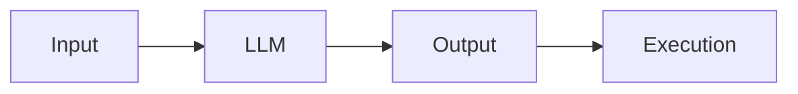
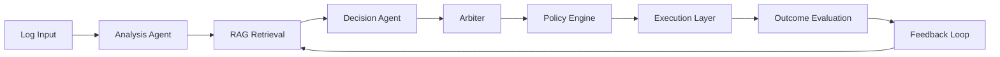
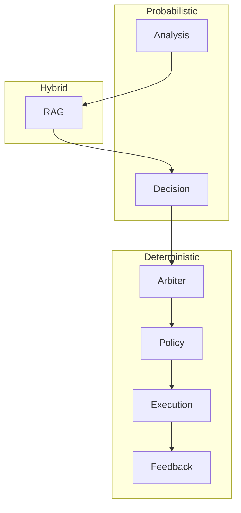
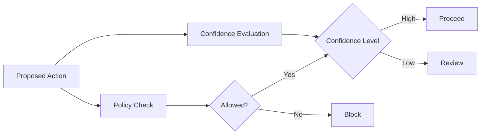
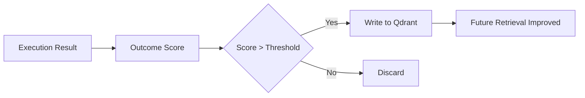
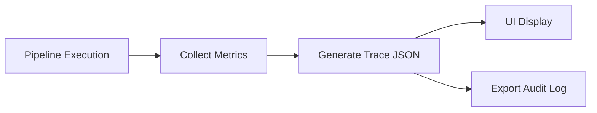
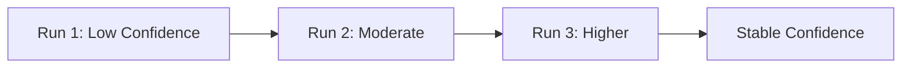

# SentinelOps AI Whitepaper

## Governance-by-Design for Agentic Systems

---

## 1. Executive Summary

SentinelOps AI is a reference architecture for building governed, explainable, and adaptive AI systems.

Modern AI systems are powerful but unreliable. This architecture ensures they are **controlled, observable, and trustworthy**.

---

## 2. Problem Statement

### Traditional AI Pattern

**Problems:**
- No validation
- No governance
- No explainability

---

## 3. SentinelOps Architecture

---

## 4. Layered Design

---

## 5. Governance Model

---

## 6. Feedback Loop (Adaptive Learning)

---

## 7. Observability Flow

---

## 8. Confidence Evolution

---

## 9. Key Principles

- LLM = hypothesis generator
- Policy = safety
- Arbiter = confidence
- Feedback = controlled learning

---

## 10. Conclusion

SentinelOps transforms:

- Black-box AI → Glass-box systems
- Stateless inference → Adaptive learning
- Automation → Governed decisioning

The challenge is not making AI powerful —
but making it **trustworthy**.
